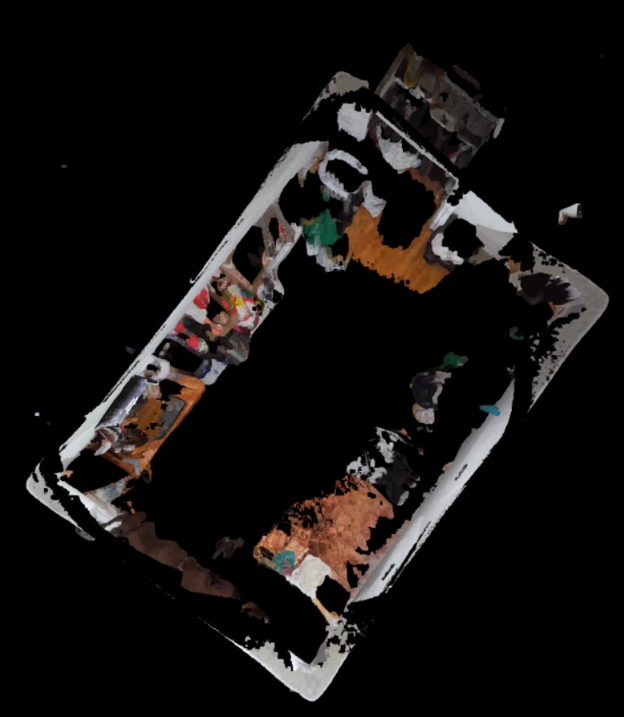
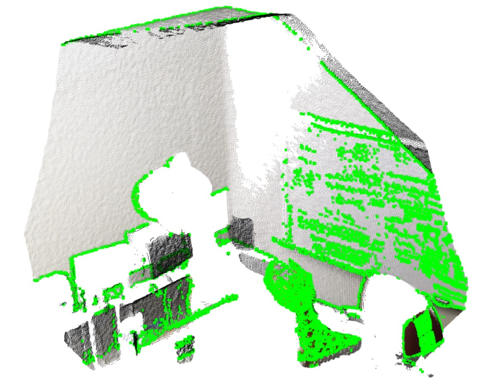

# ICP
A C++ application for consecutive pairwise alignments for a list of clouds. 

## Technical Details
### Supported OS
Windows 10

### Libraries and Tools Used
PCL 1.10   
VTK 8.2  
CMake 3.16  
Visual Studio 2019  